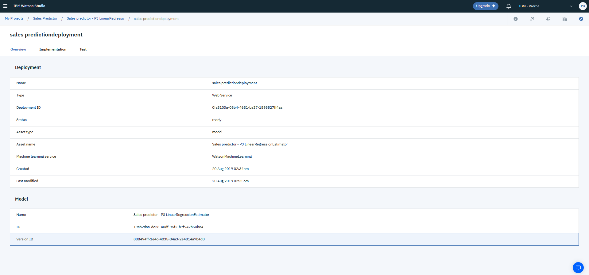

# Future-Sales-Prediction

## Predict the effect of future sales promotion using AutoAI capabilities within IBM Watson Studio

This tutorial guides you through training a model to predict the increase in sales of an item after promotion. In this tutorial, you will create an [AutoAI](https://www.ibm.com/cloud/watson-studio/autoai) experiment in IBM Watson Studio to build a model that analyzes your data and selects the best model type and estimators to produce, train, and optimize pipelines, which are model candidates. After reviewing the pipelines, you will save one as a model, deploy it, then test it to get a prediction.


### Pre-requisites

**1. IBM Cloud Account:** Visit https://ibm.biz/autoailab and fill in your details to create an account or click Log in if you already have an account


**2. Create instances of the following:** Click on 'Catalog', look for ['Object Storage'](https://cloud.ibm.com/catalog/services/cloud-object-storage), give it a name (or leave the default) and click 'Create'. Do the same to create instances for ['Watson Machine Learning'](https://cloud.ibm.com/catalog/services/machine-learning) and ['Watson Studio'](https://cloud.ibm.com/catalog/services/watson-studio)

**3. Dataset:** Download the [Sales.csv](https://github.com/prernabhojwani/Future-Sales-Prediction/blob/master/Sales.csv) dataset


### Step 1: Build and train the model

In your Watson Studio instance, click Get Started > Create a project > Create an empty project


Give your project a Name and optional Description, connect the Object Storage instance created earlier and click 'Create'.


Once created, click on Add to project > AutoAI Experiment


Give your AutoAI experiment a Name and optional Description, connect the Watson Machine Learning Service instance created earlier, leave the Compute Configuration as default and click 'Create'.


In the 'Add training data' section, drag and drop or browse for the Sales.csv file downloaded earlier to upload. 


Next we're going to train the model. 

Select 'Increase' as the column to predict. The prediction type recommended by AutoAI is Regression and the opetimized metric is RMSE. These can be changed by clicking on 'Configure prediction' but we're going to go with the recommended ones and click 'Run Experiment'.


As the model trains, you will see an infographic that shows the process of building the pipelines.


For a list of estimators available with each machine learning technique in AutoAI, you can check out: [AutoAI implementation detail](https://dataplatform.cloud.ibm.com/docs/content/wsj/analyze-data/autoai-details.html)

Once the pipeline creation is complete, you can see all the ranked pipelines in a leaderboard. You can view details of each pipeline by clicking on the '>' and compare the pipelines by clicking on 'Compare pipelines'.


Choose 'Save as model' and then click 'Save' for thr pipeline ranked 1st. This saves the pipeline as a Machine Learning asset in your project so you can deploy, train, and test it.


### Step 2: Deploy the trained model

Before you can use your trained model to make predictions on new data, you must deploy the model.

The model can be deployed from the model details page. You can access the model details page in one of these ways:

- Clicking on the model name in the notification displayed when you save the model...or,
- Open the Assets page for the project containing the model and click the model name in the Machine Learning Model section.


From the model details page, go to the 'Deployments' tab, click 'Add Deployment'. 


Give your deployment a name, an optional description, select “Web service” as the Deployment type and click 'Save'.


Once saved, click on the deployment name to view the deployment details page.

### Step 3: Test the deployed model

The deployed model can be tested from the deployment details page. On the 'Test' tab of the deployment details page, test data can be entered in the fields provided or in JSON format. 

Note that the test data replicates the data fields for the model with the exception of the prediction field.




Enter the following test data in the JSON editor (or alternatively enter the values into the fields):

```
{"input_data":[{
        "fields": ["Class","Cost","Promotion","Before","After"],
        "values": [["Luxury",13.357,1920, 117440,125073]]
}]}
```

Click 'Predict' to predict the increase in sales for that item after the promotion.


